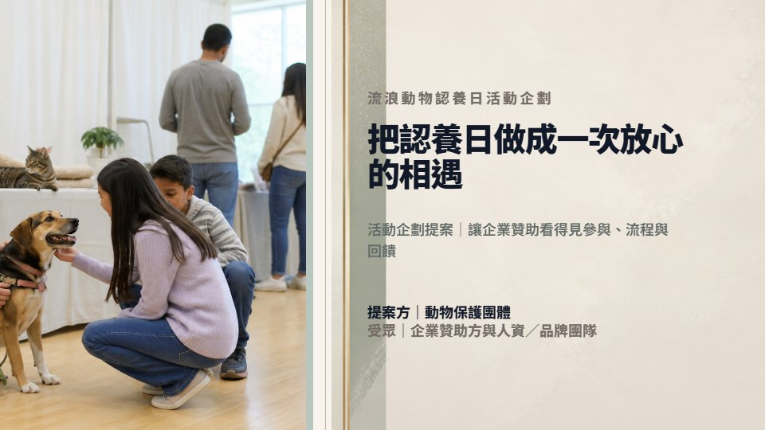
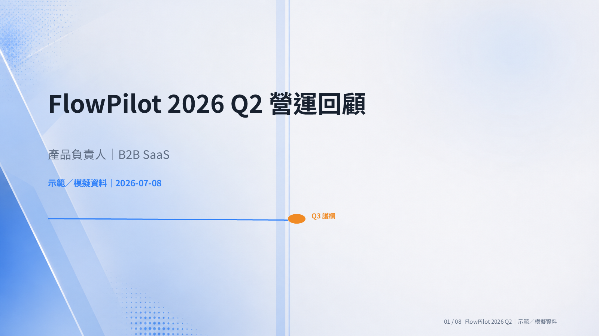
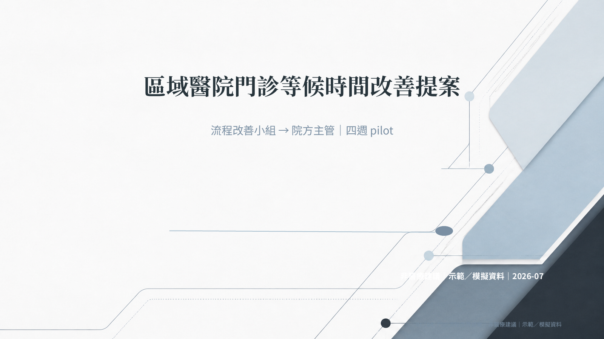

# NESA-SLIDE

**給 Codex 與 Claude Code 使用的開源 AI 簡報製作系統。**

NESA-SLIDE 把內容規劃、視覺方向、版面設計與輸出流程整理成專案 Skills，能製作 Image2 圖片式簡報、一般可編輯 HTML、含圖片的可編輯 HTML，以及原生可編輯 PPTX。

## 安裝方式

先把下面這段提示詞交給 Codex 或 Claude Code：

```text
請將 https://github.com/slidefirm/NESA-SLIDE clone 到本機。完成後先不要製作簡報，請告訴我 NESA-SLIDE 專案資料夾的位置。
```

Clone 完成後，在 Agent 中新增或開啟專案，選擇剛才下載的 `NESA-SLIDE` 資料夾作為目前的工作資料夾。之後就可以在這個專案內提出簡報需求。

## 簡報製作方式

以下四種成品各有對應的 Skill。你可以直接指定 Skill，也可以把範例提示詞貼給 Agent。

### 純圖片簡報

Image2 將每一頁製作成完整的 16:9 圖片，適合重視視覺完整度、不需要個別編輯頁面物件的場合。

#### [DEMO1：VoltGo City 新款電動機車發表會](https://slidefirm.github.io/NESA-SLIDE/image2/voltgo-city/voltgo-city-image2.pdf)


面向媒體與通路的產品發表簡報，涵蓋城市通勤需求、車款功能、App 體驗、車色與上市資訊。

#### [DEMO2：2027 港灣城市爵士音樂節招商提案](https://slidefirm.github.io/NESA-SLIDE/image2/jazz-festival-2027/jazz-festival-2027-image2.pdf)


向企業品牌說明活動定位、節目與場地、曝光版位、三種贊助方案及宣傳排程。

#### [DEMO3：珊瑚礁復育年度募款簡報](https://slidefirm.github.io/NESA-SLIDE/image2/coral-reef-annual/coral-reef-annual-image2.pdf)


在捐款人活動中呈現年度工作、合作方式、復育成果、下一年度目標、經費用途與捐款行動。

使用 Skill：[`generate-image-slide`](.agents/skills/generate-image-slide/SKILL.md)

```text
請先規劃一份關於「我的主題」的 10 頁簡報，再使用 generate-image-slide Skill 逐頁產生 Image2 圖片式投影片。
```

### 純 HTML 簡報

以下三份 Demo 都是 8 頁、可直接在瀏覽器播放與編輯的完整簡報。

#### [DEMO1：新任店長內訓簡報](https://slidefirm.github.io/NESA-SLIDE/store-manager-30-60-90/store-manager-30-60-90.html)


連鎖零售人資部提供給新任店長的內訓簡報，內容涵蓋交接、班表、庫存、客訴與階段檢核。

#### [DEMO2：社區大樓防災說明會](https://slidefirm.github.io/NESA-SLIDE/building-disaster-48h/building-disaster-48h.html)


管委會在颱風季前向住戶說明的實用簡報，包含家庭準備、公共區域分工、停電通報與演練安排。

#### [DEMO3：舊車站再利用提案](https://slidefirm.github.io/NESA-SLIDE/station-market-weekend/station-market-weekend.html)


地方團隊向公所與商圈協會提出的週末市集營運提案，內容包含場地分區、攤商組合、動線、預算與試營運指標。

使用 Skill：[`html-pattern-slide`](.agents/skills/html-pattern-slide/SKILL.md)

```text
請使用 html-pattern-slide Skill，製作一份關於「我的主題」的 10 頁可編輯 HTML 簡報。
```

### 圖片背景 HTML 簡報

以下三份 Demo 以照片支撐實際提案內容，同時保留可編輯文字、物件、播放與 HTML 儲存功能。

#### [DEMO1：台東海岸旅宿品牌提案](https://slidefirm.github.io/NESA-SLIDE/taitung-coast-lodge/demo.html)


從目標旅客、住宿體驗與房型差異，一路規劃到開幕宣傳與預約轉換。

#### [DEMO2：流浪動物認養日活動企劃](https://slidefirm.github.io/NESA-SLIDE/adoption-day/demo.html)



向企業贊助方說明參與流程、犬貓分區、志工與獸醫配置、宣傳安排及贊助回饋。

#### [DEMO3：春季草莓烘焙新品上市計畫](https://slidefirm.github.io/NESA-SLIDE/spring-strawberry-launch/demo.html)


向門市主管介紹三款新品、客群與價格、店頭陳列、社群拍攝方向及四週上市排程。

使用 Skill：[`html-image-slide`](.agents/skills/html-image-slide/SKILL.md)

```text
請使用 html-image-slide Skill，製作一份關於「我的主題」的 10 頁可編輯 HTML 簡報，讓照片或插圖成為主要構圖，並保留文字與物件的可編輯性。
```

### PPTX 簡報

以下三份 Demo 都是 8 頁、保留原生文字、形狀、圖表與版面的可編輯 PowerPoint。

#### [DEMO1：FlowPilot 2026 Q2 營運回顧](demos/pptx/flowpilot-2026-q2-clean.pptx)



FlowPilot 以 MRR、續約與客服證據串起 Q2 判讀，最後落到 Q3 的產品投資與商務護欄。

#### [DEMO2：區域醫院門診等候時間改善提案](demos/pptx/regional-hospital-waiting-pilot-clean.pptx)



提案把門診等待拆成可觀察的流程段，以低變更、可撤回的四週試辦支援院方決策。

#### [DEMO3：消費電子製造商供應商雙源策略](demos/pptx/consumer-electronics-dual-source-clean.pptx)


從單一來源風險收斂到四個供應商驗證行動，呈現成本上限、交期與 90 天出口條件。

使用 Skill：[`ppt-builder`](.agents/skills/ppt-builder/SKILL.md)

```text
請使用 ppt-builder Skill，製作一份關於「我的主題」的 10 頁原生可編輯 PPTX。文字、形狀與版面必須能在 PowerPoint 中繼續編輯，不要把整頁做成圖片。
```

## 其他 Skills

| Skill | 什麼時候使用 |
| --- | --- |
| [`design-presentations`](.agents/skills/design-presentations/SKILL.md) | 還沒決定輸出格式，或需要先規劃整份簡報的視覺方向與跨頁節奏。 |
| [`slide-outline-planner`](.agents/skills/slide-outline-planner/SKILL.md) | 只需要大綱、逐頁內容、講稿或版面建議，還不需要產出成品。 |
| [`slide-background-image`](.agents/skills/slide-background-image/SKILL.md) | 已經有 HTML，只需要新增、替換或檢查逐頁圖片背景。 |

## License

本專案採用 [MIT License](LICENSE) 開源。
